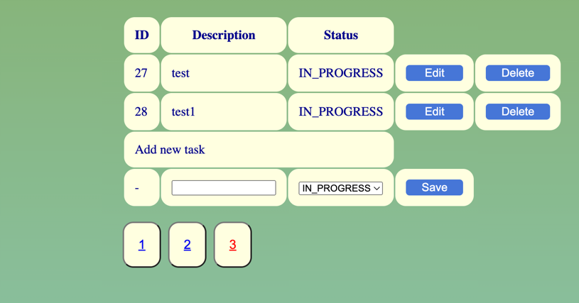

# String_pr1

Первый учебный проект по Spring MVC.

Проект разворачивается в Docker с двумя контейнерами (db и web-app)

Пример внешенего вида и тестовых данных:

Функционал: создавать, редактировать, удалять таски из списка

